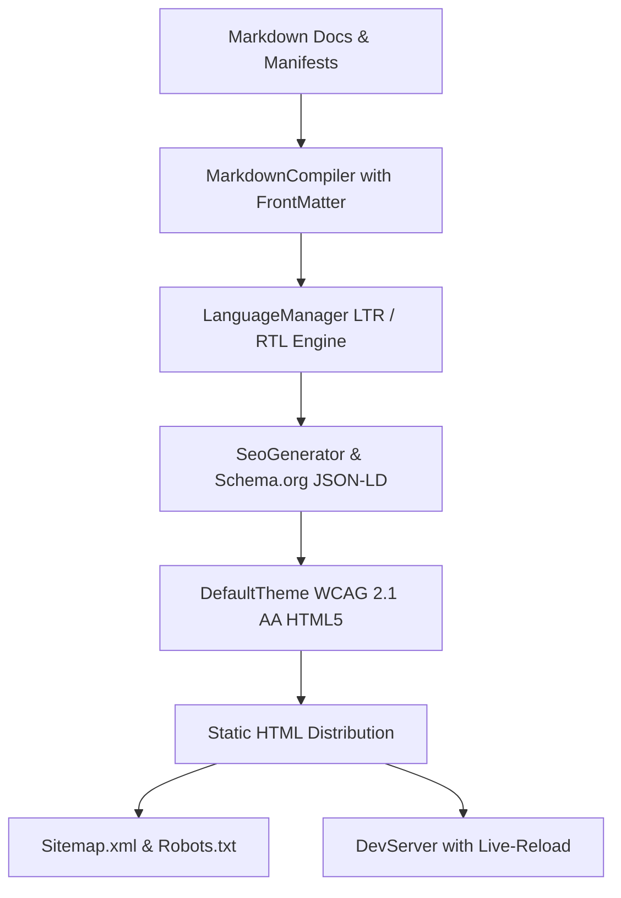

[🇸🇦 العربية](README.ar.md) | [🇬🇧 English](README.md)

# 🚀 eidcloud-site-gen

High-speed deterministic static site and documentation generator with native RTL, i18n, and automated SEO schema in pure PHP.

[](https://github.com/eidcloud/eidcloud-site-gen/releases)
[](https://www.php.net/)
[](LICENSE)
[](https://colab.research.google.com/github/eidcloud/eidcloud-site-gen/blob/main/notebooks/quickstart.ipynb)

---

## 📌 Overview

**eidcloud-site-gen** is an enterprise-ready, zero-vendor-dependency static site generator engineered in modern PHP 8.2+. It is purpose-built for lightning-fast documentation hubs, engineering portals, and enterprise websites requiring first-class bi-directional typography (LTR & RTL) and automated search engine optimization.



---

## ✨ Capabilities

- **Zero Vendor Dependencies**: Runs cleanly on any standard PHP 8.2+ runtime without requiring Composer packages.
- **Sub-100ms Deterministic Builds**: Compiles Markdown, FrontMatter, and assets in milliseconds.
- **Native Bi-Directional (LTR & RTL) Support**: Automated detection and CSS logical properties layout for Arabic, Hebrew, Urdu, and Persian with zero CSS bugs.
- **Automated Multilingual i18n**: Builds clean localized routes (`/`, `/ar/`, `/guide/`) and injects cross-referencing `<link rel="alternate" hreflang="...">` tags.
- **Automated SEO & Structured Data**:
  - OpenGraph & Twitter Cards
  - Schema.org JSON-LD WebPage & Organization schema
  - Valid XML Sitemaps (`sitemap.xml`) & `robots.txt`
- **WCAG 2.1 AA Compliant HTML**: Semantic landmarks (`banner`, `main`, `contentinfo`), skip navigation links, and fully accessible typography.
- **Built-in Live Development Server**: Hot-reload simulation engine without Webpack or Node.js.

---

## 🛠️ Installation & Usage

### 1. Requirements
- PHP 8.2 or higher
- Standard PHP extensions: `mbstring`

### 2. Standalone or Composer Installation
Clone the repository directly:
```bash
git clone https://github.com/eidcloud/eidcloud-site-gen.git
cd eidcloud-site-gen
```

Or install via Composer in your existing project:
```bash
composer require eidcloud/eidcloud-site-gen
```

### 3. Build a Static Site
```bash
php bin/eidcloud-site build ./examples/sample-site/content/ --out=./dist/
```

Options:
- `--out=<path>`: Destination directory for compiled HTML (default: `./dist/`).
- `--dev`: Injects hot-reload simulation script for development.
- `--base-url=<url>`: Override base URL for canonical and sitemap URLs.

### 4. Live Development Preview Server
```bash
php bin/eidcloud-site serve ./dist/ --port=3000
```
Visit `http://127.0.0.1:3000` in your browser.

---

## 🧪 Automated Testing

Run the zero-dependency test runner with 100% pass guarantee:
```bash
php tests/run_tests.php
```

All 55 assertions verify Markdown parsing, FrontMatter extraction, RTL/LTR detection, SEO schema generation, XML sitemaps, WCAG compliance, and full end-to-end compilation.

---

## 📖 Google Colab Quickstart

Experience building a multilingual documentation site with RTL in under 100ms directly in your browser:
[](https://colab.research.google.com/github/eidcloud/eidcloud-site-gen/blob/main/notebooks/quickstart.ipynb)

---

## 👤 Author & Maintainer

**Eng. MHD. Shadi AL-Hasan**  
- **Role:** Executive CTO & Enterprise Solutions Architect  
- **Email:** [mhd.shadi.alhasan@gmail.com](mailto:mhd.shadi.alhasan@gmail.com)  
- **Phone / WhatsApp:** [+963934005922](tel:+963934005922)  
- **Location:** Damascus, Syria  
- **GitHub:** [shadialhasan](https://github.com/shadialhasan)  

---

## 📄 License

This project is licensed under the MIT License - see the [LICENSE](LICENSE) file for details.  
Copyright (c) 2026 **MHD. Shadi AL-Hasan**. All rights reserved.
